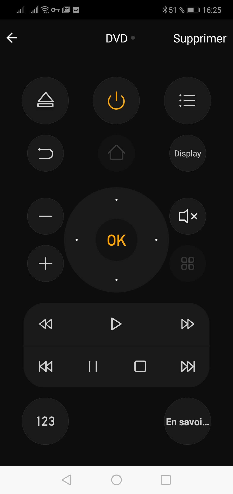
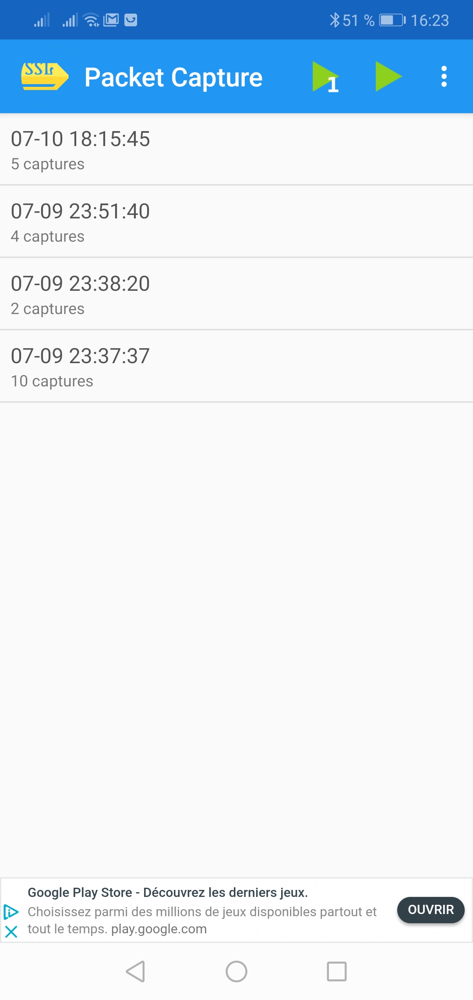
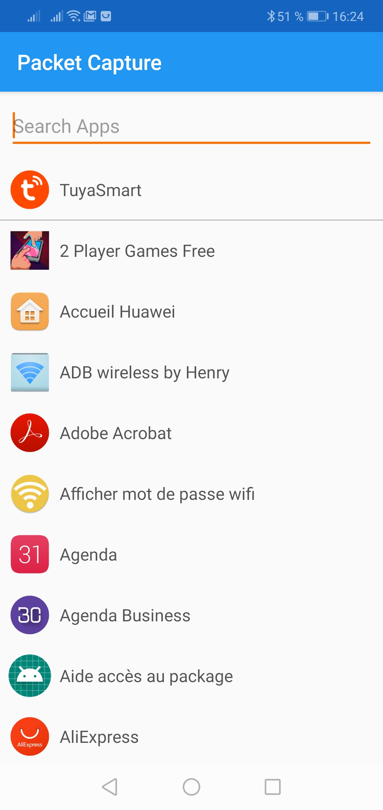
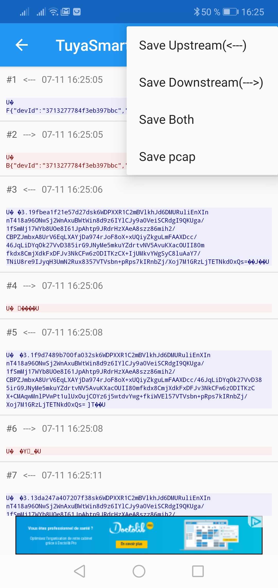
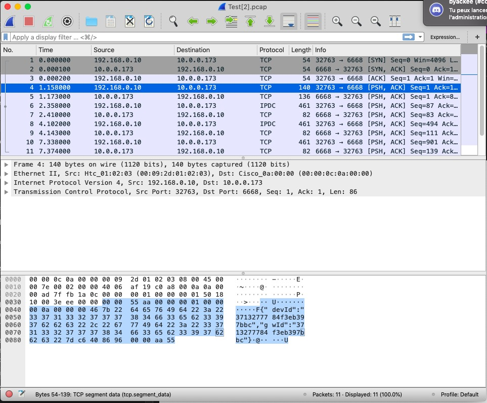
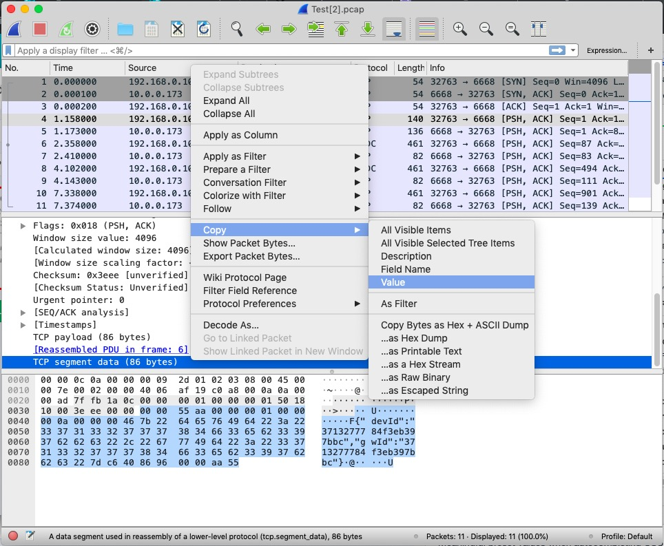
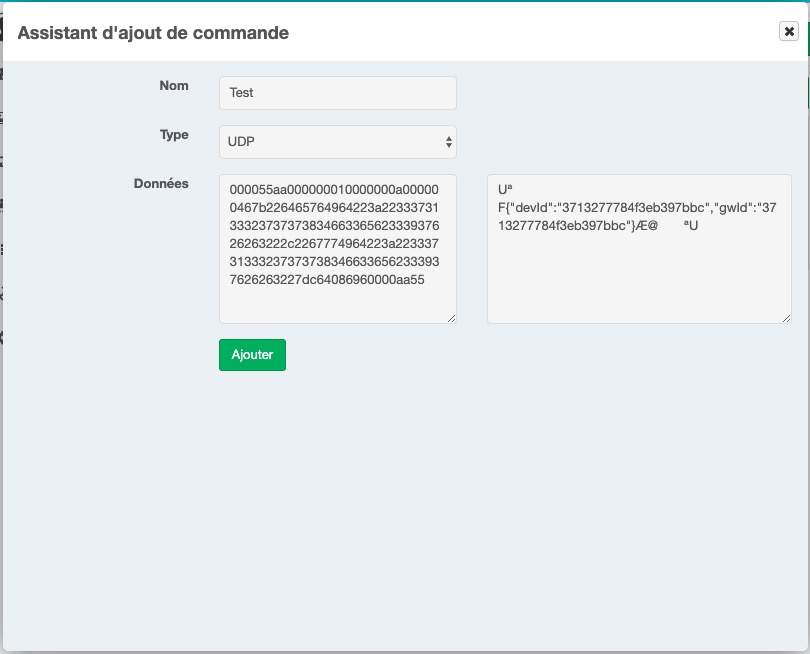

# Plugin Raw Network
Plugin NextDom/Jeedom qui permet d'envoyer des données brutes par le réseau au formation hexadécimal.
Il devient ainsi possible de renvoyer des paquets capturés et contrôler des périphériques n'ayant pas de possibilité d'interfacage.

# Exemple d'utilisation

Pour les périphériques de la marque Tuya, il existe une application pour mobile mais pas de plugin. Une méthode existe mais reste complexe.
Pour le contrôler, l'application envoie un paquet qui correspond à une commande.
Il est possible de capturer ce paquet avec un outil approprié (pour l'exemple, [Packet Catpure](https://play.google.com/store/apps/details?id=app.greyshirts.sslcapture&hl=fr)).
## Démarche
Lancer l'application qui permet de contrôler le périphérique : 

Aller sous l'application Packet Capture : 

Lancer la capture et choisir l'application : 

Retourner sur l'application et lancer la commande : 

Une fois lancé, le paquet est capturé. Ils doivent être exportés au format __pcap__ pour l'analyser plus simplement : 

Ce fichier peut être lu par des applications comme [WireShark](https://www.wireshark.org/).
Une fois ouvert, il faut retrouver le paquet qui lance la commande : 

Il faut ensuite copier les données envoyées (et ne pas prendre les entêtes) : 

Dans le plugin ajouter un équipement puis une commande, il est possible de tester directement si le paquet fonctionne : 

